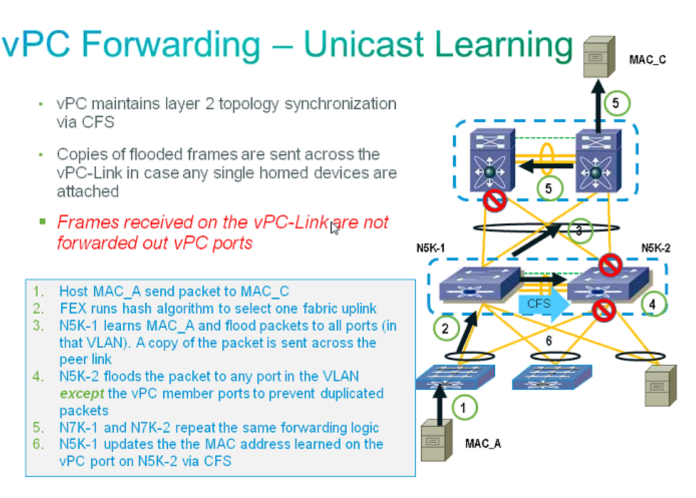

# vPC (Virtual Port-Channel)

## Terminology
- vPC Domain: A piar of vPC switches.
- vPC Peer: a vPC switch, one of a pair.
- vPC member port: one of a set of ports (port channels) that form a vPC.
- vPC: the combined port channel between the vPC peers and the downstream device.
- vPC peer-link: link used to synchronize state between vPC peer devices, must be 10GE. Control Plane comunication, sometime data traffic.
- CFS: Cisco Fabric Services protocol, used for state synchronization and configuration validation between vPC peer devices.
- vPC peer-keepalive link: the keepalive link between vPC peer devices. Prevent "split brain" problems, used in failure scenarios.
- vPC VLAN: Any of the VLANs carried over the peer-link and used to communicate via vPC with a peer device.
- non-vPC VLAN: Any of the STP VLANs not carried over the peer-link.

- orphan ports
- single homed devices

## vPC Configuration
**Order does Matter!!!**
1. Define domains
2. Establish Peer Keepalive connectivity
3. Create a Peer link
4. Reuse port-channels and Create vPCs
5. Make sure configurations are consistent

### Domain
- vPC Domain defines the grouping of switches participating in the vPC.
- Provides for definition of global vPC system parameters.
- The vPC peer devices use the vPC domain ID to automatically assign a unique vPC system MAC address.
- You MUST utilize unique Domain id´s for all vPC pairs defined in a contiguous layer 2 domain.
```
feature vpc
vpc domain 20
!Check the vPC system MAC address
show vpc role
```
- LACP neighbor sees the same System ID from both vPC peers. `show lacp neighbor`
- The vPC 'system-mac' is used by both vPC peers. `show vpc role`
- vPC peers function as independent devices as weel as peers.
- Local 'system-mac' is used for all non vPC PDUs (LACP,STP,...)

### Peer Keepalive
- Peer Keepalive provides and out of band heartbeat between vPC peers.
- Purpose is to detect and resolve roles if a Split Brain (Dual Active) occurs.
- Messages sent on 1s interval with 5s timeout.
- 3s hold timeout on peer-link loss before triggering recovery.
- Should not be carried over the Peer-link.
- Keepalives sourced and destined to the mgmt0 interface.
- Keep-alives can be routed over L3 infrastructure.
- Packet Structure: UDP message on port 3200, 96 bytes long (32 byte payload), includes version, time stamp, local and remote IPs, and domain ID.
- Default timers: interval 1sec / timeout 5s
```
vpc domain 20
peer-keepalive destination 172.26.161.201 source 172.26.161.200 vrf management
! default on vrf management
```
#### Recommendations (in order of preference):
1. Dedicated link(s) (1GE LC)
2. mgmt0 interface (along with management traffic) (or use a dedicated vrf)
3. As last resort, can be routed over L# infrastructure.

### Peer Link
- Peer Link carries both vPC data and control traffic between peer switches.
	- Carries any flooded and/or orphan port traffic.
	- Carries STP BPDUs, HSRP Hellos, IGMP updates, etc.
	- Carries CFS messages (vPC control traffic)
- Minimum 2 x 10GbE ports
- It is not recommended to share vPC and non-vPC traffic on the same Peer Link
- LACP portchannel
```
interface port-channel 20
 switchport mode trunk
 switchport trunk native vlan 100
 switchport trunk allowed vlan 100-105
 vpc peer-link
 spanning-tree port type network
 ! enable bridge assurance
```
### Member Port
- Definition: Port-channel member of a vPC
- Requirements:
	- Configuration needs to match other vPC peer's member port config.
	- In case of inconsistency a VLAN or the entire port-channel may be suspended (e.g. MTU mismatch)
	- Up to 16 active ports between both vPC peers with M series LC.
	- Up to 32 active ports between both vPC peers with F series LC.

switch1:
```
interface port-channel 201
! port channel id doesn't need to match
 switchport mode trunk
 switchport trunk native vlan 100
 switchport trunk allowed vlan 100-105
 vpc 201
```
switch2:
```
interface port-channel 201
! port channel id doesn't need to match
 switchport mode trunk
 switchport trunk native vlan 100
 switchport trunk allowed vlan 100-105
 vpc 201
```

### vPC Configuration - Overview
switchB:
```
feature vpc
feature lacp

vpc domain 10
 peer-keepalive destination 1.1.1.2 source 1.1.1.1 vrf management
```
switchA:
```
show run int po 1

interface port-channel 1
 switchport mode trunk
 vpc peer-link
 spanning-tree port type network
```
switchA:
```
show run int mgmt0

interface mgmt0
 ip address 1.1.1.1
```
switchA:
```
show run int po 201

interface port-channel201
switchport mode trunk
switchport trunk allowed vlan 100-105
vpc 201
```
switchB:
```
show run int po 201

interface port-channel201
switchport mode trunk
switchport trunk allowed vlan 100-105
vpc 201
```

## vPC Initialization
1. VPC manager starts
2. Peer-keepalive comes up (receives keepalives from the peer)
3. Peer-link comes up (data is not passing through yet, just CFS)
4. Primary/Secondary ROle resolved
5. Global Consistency check
6. Peer-link is up for data
7. SVIs brought up (VPC + 10sec)
8. VPCs brought up (SVI + 30sec)

## Troubleshooting VPC
### Initialization
```
sh vpc
```
### vPC Consistency Check
- Two types of global consistency checks:
	- Type 1: All VPC port-channels will go into a suspended state.
	- Type 2: Error messages to indicate potential for undersired forwarding behavior

- Two types of interface consitency checks:
	- Type 1: Will put interface intro suspend state to prevent invalid forwarding of packets. With Gracefull Consistency chechk only suspend on secondary switch.
	- type 2: Error messages to indicate potentialfor undesired forwarding behavior.

#### vPC Consistency Check - Type 1
- Intended to prevent network failures.
	- Incorrectly forwarding of traffic
	- Physical network incompatibilities
- vPC will be suspended
- Useful commands:
```
sh run int po 201
! must be the same output on both devices
``` 
```
show vpc brief
``` 
#### vPC Consistency Check - Type 2
- Type 2 Consistency Checks are intended to prevent undesired forwarding
- vPC will be modified in certain cases (e.g. VLAN mismatch)
- only allowed VLANs in common.
- Useful commands:
```
sh vpc consistency-parameters vpc 20
```
```
sh vpc consistency-parameters global
``` 

## vPC Forwarding
### Rule Number 1
- To achieve the "optimal usage of peer-link goal, learning on the Peer Link is such that the MAC addresses learned on a peer's vPC port are learned on "local" vPC ports instead of Peer-link.
- This is done by disabling learning in the hardware on Peer-link ports. The MAC addresses learned on a switch's non vPC ports are notified to the peer switch via CFSoE in address update messages indicating the interface on which it is learned.
- When the update message is received from the peer, the local switch will update the local MAC table with the destination of:
	- The local vPC port if it was learned on an vPC port oh the peer switch
	- The Peer-link port if it was learned on a non vPC port (Orphan Port)
### Rule Number 2


### Unicast Learning
- vPC maintains layer 2 topology synchronization via CFS.
- Copies of flooded frames are sent across the vPC-Link in case any single homed devices are attached
- Frames recived on the vPC-Link are not forwarded out vPC ports.




