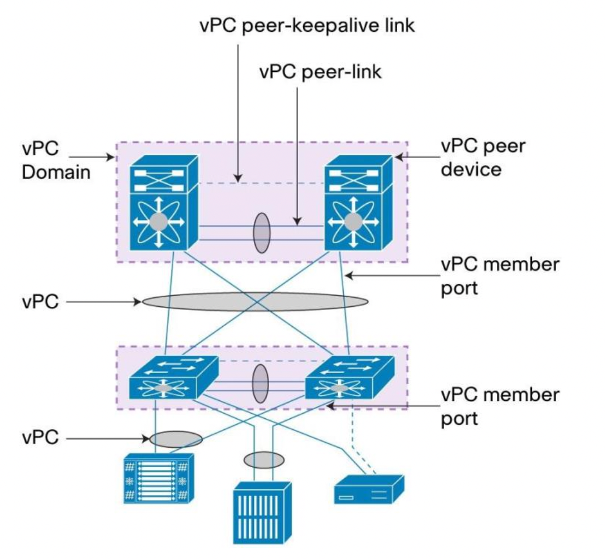

# vPC Notes

## Components of vPC

- vPC: The combined port-channel between the vPC peers and the downstream device. A vPC is a L2 port type: switchport mode trunk or switchport mode access
 
- vPC peer device: A vPC switch

- vPC domain: Domain containing the 2 peer devices. Only 2 peer devices max can be part of same vPC domain.

- vPC member port: One of a set of ports (that is, port-channels) that form a vPC (or port-channel member of a vPC).

- vPC peer-link: Link used to synchronize the state between vPC peer devices. It must be a 10-Gigabit Ethernet link. vPC peer-link is a L2 trunk carrying vPC VLAN.
 
- vPC peer-keepalive link:  The keepalive link between vPC peer devices; this link is used to monitor the liveness of the peer device. L3 link.

- vPC VLAN: VLAN carried over the vPC peer-link and used to communicate via vPC with a third device. As soon as a VLAN is defined on vPC peer-link, it becomes a vPC VLAN
 
- non-vPC VLAN: A VLAN that is not part of any vPC and not present on vPC peer-link.

- Orphan port: A port that belong to a single attached device. vPC VLAN is typically used on this port.
 
- Cisco Fabric Services protocol (CFS):  Underlying protocol running on top of vPC peer-link providing reliable synchronization and consistency check mechanisms between the 2 peer devices.

 

